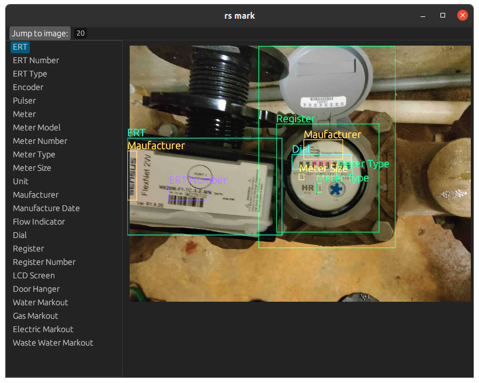

# Yolo Mark RS
I've drawn too many boxes in yolo_mark, its usable but has some rough edges
- always selects the larger box on hover (cannot delete inner annotations)
- slow with medium-large sized images
- left/right arrow increments/decrements both image and tag
- boxes have no transparency
- no keybindings (my implementation still not ideal in this regard but will be improved on)

So I've resolved these and this is the result.

---
# Roadmap

- [ ] add a limit to the cache (it munches memory if you annotate enough images, you can resize to clear cache for now)

- [ ] multi-digit names shortcuts (type 1 1 quickly to get names #11)

- [ ] drag boxes

- [ ] changing settings in GUI (and more settings such as box thickness and alpha)

- [ ] run from web server

- [ ] abstract out traits to allow other export formats and annotation styles

# Running

needs the rust toolchain to compile. I'll eventually release binaries. Currently, only runs on Nightly

`cargo run --release <path to images> <path to names file>`

on linux there is also some extra libs needed for egui to work. Debian-based distros you will also have to run the following (for other distros it is left as an exercise to the reader)

`sudo apt-get install libxcb-render0-dev libxcb-shape0-dev libxcb-xfixes0-dev libspeechd-dev`
